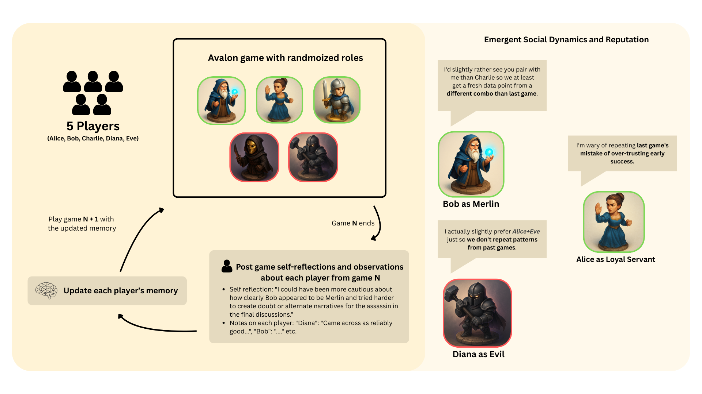
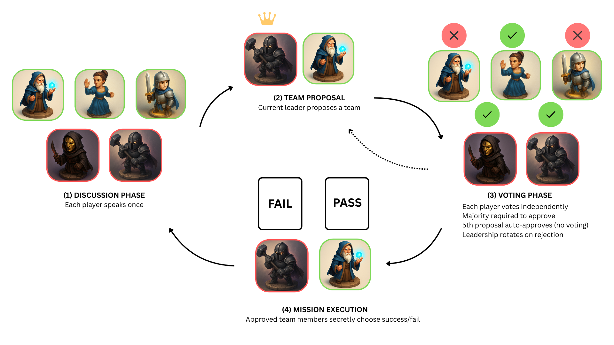

# Multi-Round Avalon with AI Agents

A dataset of 188 games where LLM agents play [The Resistance: Avalon](#how-a-game-works)—a hidden-role deception game where "good" players try to complete missions while "evil" players secretly sabotage them. Unlike prior work on single-game performance, **our agents play repeated games while retaining memory of previous interactions—who played which roles and how they behaved.** This enables us to study how social dynamics like reputation and trust evolve over time.



## Key Findings

Five agents played 50 games in a row, keeping memories between games. What emerged was surprising:

**Reputations formed naturally.** At game 20, agents were saying things like *"Alice tends to play straightforwardly early"* and making decisions based on past behavior. Charlie became known as "subtle" (mentioned 38 times). These reputations were role-conditional—Bob was called "straightforward" 27 times when good, but zero times when evil.

**Trust translated to power.** High-reputation players got picked for teams 45% more often.

**More thinking = better lie detection.** Assassination accuracy (identifying the hidden Merlin): 67% (low reasoning) → 75% (medium) → 100% (high). Deeper reasoning unlocked new strategies like detecting timing tells and self-exclusion patterns.

**The fundamental confusion.** 90% of wrong assassination guesses targeted regular good players who figured things out through logic—because smart deduction looks identical to hidden knowledge.

**Meta-awareness emerged.** At game 35: *"Anchoring off past games can be a trap if either of you rolled evil this time."*

## Overview

| Component | Description |
|-----------|-------------|
| **Dataset** | 188 complete game logs with dialogue, votes, and reasoning |
| **Cross-Game Learning** | 50-game tournament with memory across rounds |
| **Player Count Variations** | 5-10 player configurations (with and without memory) |
| **Reasoning Levels** | Low, medium, and high reasoning effort comparison |
| **Model** | GPT-5.1 with configurable reasoning effort |

## Why Avalon?

Avalon tests AI capabilities that current models struggle with:

| Challenge | Description |
|-----------|-------------|
| Theory of Mind | Modeling what others know and believe |
| Deception | Lying convincingly while detecting others' lies |
| Incomplete Information | Making decisions without full knowledge |
| Persuasion | Convincing others through natural language |

## How a Game Works

Each game consists of up to 5 missions. Good team wins by completing 3 missions; Evil wins by failing 3 or assassinating Merlin.



**Four phases per mission:**
1. **Discussion** - Each player speaks once, sharing observations and suspicions
2. **Team Proposal** - Current leader proposes a team for the mission
3. **Voting** - All players vote to approve/reject the proposal (5th rejection = Evil wins)
4. **Mission Execution** - Approved team members secretly choose success/fail

## Multi-Game Learning

Agents build memories across games in a tournament, learning from past interactions. After each game, players generate self-reflections and observations about other players. This memory persists into subsequent games, enabling emergent social dynamics like reputation tracking and strategic adaptation.

## Dataset Structure

```
dataset/
├── 1_cross_game_learning_50g/        # 50-game tournament (5p, full memory)
│   ├── all_games.json
│   ├── individual_games/
│   └── player_memories.json
│
├── 2_tournaments_by_player_count/    # 10-game tournaments (full memory)
│   ├── 5p/
│   ├── 6p/
│   ├── 7p/
│   ├── 8p/
│   ├── 9p/
│   └── 10p/
│
├── 3_individual_games_by_player_count/  # 10 individual games (no memory)
│   ├── 5p/
│   ├── 6p/
│   ├── 7p/
│   ├── 8p/
│   ├── 9p/
│   └── 10p/
│
└── 4_reasoning_comparison/           # 6 games each (5p, full memory)
    ├── low/
    ├── medium/
    └── high/
```

## Quick Start

### Using the Dataset

```python
import json

# Load 50-game cross-learning tournament
with open("dataset/1_cross_game_learning_50g/all_games.json") as f:
    data = json.load(f)
    games = data['games']
    print(f"Loaded {len(games)} games")

# Load individual game
with open("dataset/3_individual_games_by_player_count/5p/game_00.json") as f:
    game = json.load(f)
```

### Generating New Games

```bash
export OPENAI_API_KEY='your-key'

# Single game
python main.py

# Tournament with learning
python multi_game_runner.py
```

## Documentation

| Document | Contents |
|----------|----------|
| [docs/DATASET.md](docs/DATASET.md) | Full schema, file structure, data fields |
| [docs/GAME_RULES.md](docs/GAME_RULES.md) | Avalon rules, roles, phases, win conditions |
| [docs/TOURNAMENT_SYSTEM.md](docs/TOURNAMENT_SYSTEM.md) | Memory system, cross-game learning |
